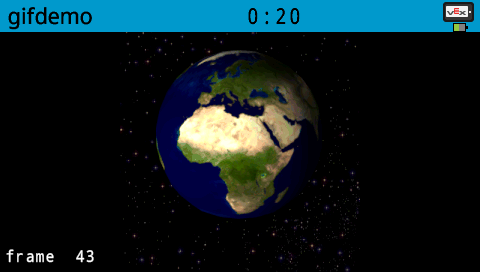

Demo for displaying animated gif on V5 screen
---

C++ class for displaying animated gif on Vex Robotics, V5 brain.   

Heap may need to be increased, edit vex/mkenv.mk to do that.   
Add the following to linker flags.   
```
--defsym _HEAP_SIZE=0x800000
```

gif file should be on an SD Card, the gif will be read into memory to optimize performance, alternatively, the optional flag to the Gif constructor will allow reading gif data directly from the SD Card file.   


```cpp
#include "gifclass.h"

using namespace vex;

int main() {
  vex::Gif gif("world.gif", 120, 0 );

  while(1) {
    Brain.Screen.printAt( 5, 230, "frame %3d", gif.getFrameIndex() );
    this_thread::sleep_for(10);
  }
```

---
   


